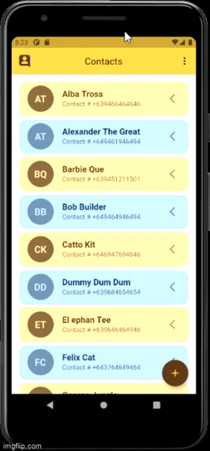

#   Phonebook Application

**Phonebook application** that uses **Flutter** SDK via **Android Studio IDE** as a front-end. With a back-end of [[Node.js REST API](https://github.com/AY2020-2021-CpE-OJT/JW-Phonebook-API-TASK005)] it uses **Express and CORS middleware**, **Mongoose**, **MongoDB Atlas**, **Joi**, and **JSON Web Token**. It features **C**reate, **R**ead, **U**pdate and **D**elete with **Authentication** and **Validation** upon login and **Creating or Updating Contacts(No UI yet)**. It is integrated to Cloud via **Heroku**.

>## Release
>**July 25, 2021** [[Latest Release](https://github.com/AY2020-2021-CpE-OJT/jw-phonebookapp-005/releases/tag/v0.2.1-alpha)] Phonebook APP [Android] ver.0.2.1-alpha 

## Developer's Note
This is an Application created through the series of Tasks in the OJT, **Creating an application** and **Learning modern cross-platform technologies** that enable us to broaden our knowledge in regards to software programming and development. The codes are **far from perfect** but tackle the required Tasks. The **server-side** have complete validation and authorization from creating contacts, updating contacts, login, and registration. On the **client-side** for creating and updating contacts, the **UI output and validation are lacking**. 
#### Features:
> ###### Main
> 1. **Get** and **display** All the Contacts as a list **[Requires a token]**.
> 2. **Create New** Unique(Firstname, Lastname) Contact (Working but no UI indication) **[Requires a token]**.
> 3. **Edit Existing Contact** and it retains its Uniqueness(Firstname, Lastname) (Working but no UI indication) **[Requires a token]**.
> 4. **Delete a Specific Contact** Permanently **[Requires a token]**.
> ###### Login and Registration
> 1. **User registration** have server-side and client-side validation(Unique Email and Username, Correct Inputs) and data is hashed.
> 2. **User Login** is validated(Existing and Correct Email and Password, Correct Inputs) in which generates a token using JWT on the API.
>
>> The Application uses a CRUD REST API powered by Node.js via Heroku Cloud.

## Screens

A preview of the application's screen.

>#### Navigate -> App Login Screen
>

>#### Register Screen
> Correct form Value -> Validation Server-side -> Validation Client-side -> Back Press Dialog
>
>
>
>
>

>#### Login Screen -> Contact List
> Correct Form Value login 
>
>

>#### Contact List
> List of Contacts -> View Specific Contact Data -> Refresh List 
>
>
>
>

>#### Create New Contact
> Create New Contact then to List -> Refresh Values to null -> Remove Individual Values from Forms
>
>
>
>

>#### Delete Contact
>

>#### Edit a Contact
> Correct Form Value then to List -> Back Dialog -> Remove Specific Number -> Remove all Numbers
>
>
>
>
>

>#### Misc
> Toast of App Version -> View Current Account Accessing the APP -> About the app -> Stay Logged in when Close -> Upon Logged out remains Logged out.
>
>
>
>
>
>
>> **Note:** **GIF are Low FPS** and **High Contrast** due to **Recording Issue**. **Initialize** the numbers of the user first when updating a contact. You can Download the 
[[Latest Release](https://github.com/AY2020-2021-CpE-OJT/jw-phonebookapp-005/releases/tag/v0.2.1-alpha)] to view the alpha version of the application.

## Future
* The Future of the App, the response from the server-side will have a UI when Creating or Editing a Contact. 
* Email OTP for Verification.
* Have Separate DB of Contacts List for each users.